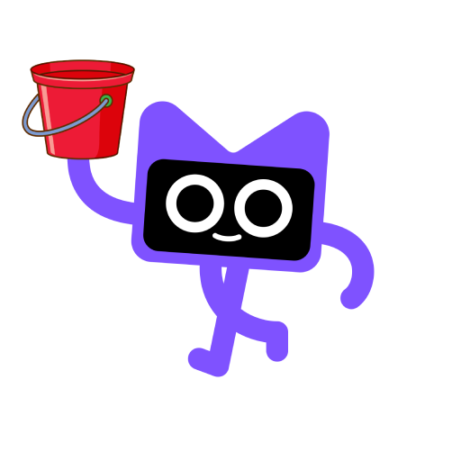

## Kodee: the garbage collector

> Help Kodee collecting memory garbage, while avoiding memory leaks!

This simple 2D game is a testing demo for the [Godot Kotlin/JVM bindings](https://github.com/utopia-rise/godot-kotlin-jvm).

    

### Code Structure

The repository is structured in the following order:

* the `src` folder contains all the Kotlin file used to run the game logic.
* `scenes` contains the Godot scenes files (e.g., Kodee, the trash, the main scene...)

